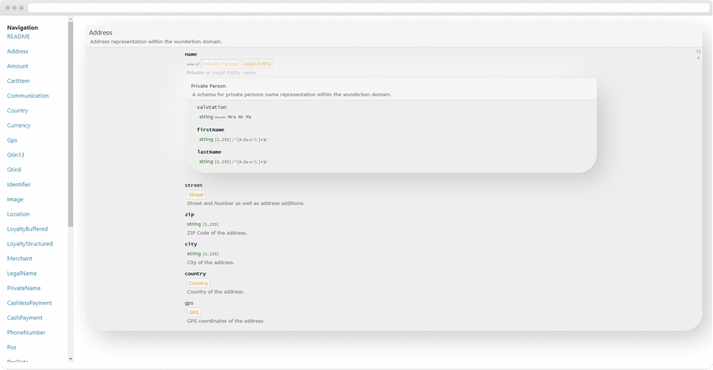

# wunderbon | smart receipts

## Documentation `json-schemas`

wunderbon **json-schemas** as blueprints for data structures and contracts like interfaces, models and helpers. Always up to date with the latest API specification.

## Classification

`Open-Source`

---

## Info & Status
     

---

---

## Table of Contents

- [Features](#features)
- [Requirements](#requirements)
- [Build](#build)
- [Configure](#configure)
- [Install](#install)
- [Deploy](#deploy)
- [Run](#run)
- [Philosophy](#philosophy)
- [Versioning](#versioning)
- [Roadmap](#roadmap)
- [Security-Issues](#security-issues)
- [License »](LICENSE)

---

## Features

 - Easy browsable `JSON-Schemas` with implemented webserver (Node.JS)
 - Blueprints of data I/O for our REST APIs (standard >= [JSON Schema Draft 4](http://json-schema.org/ "JSON Schema Draft")).
 - Clean & well documented

---

## Requirements

 - `Node.JS >= 12.0.0`
 - `npm >= 6.0.0`

---

## Install
Extract or clone the repository to a directory of your choice and run the following command:

`npm install`

---

## Run
To start the server you just need to the following command:

`npm start`

After starting the server you will see a message like `@wunderbon/json-schemas server listening on port 8080 (HTTP) ...` in the console telling you that the server is listening for connections on port *8080* or the port you have configured.

**Warning!**
If you are already running a service on port *8080* you will need to define a `ENV` variable with name `WUNDERBON_JSON_SCHEMAS_PORT` and set its value to the port you will use for this service instead (e.g. *WUNDERBON_JSON_SCHEMAS_PORT=8181*).

---

## Philosophy

A lot of ❤️ for code, documentation & quality!

---

## Versioning

For a consistent versioning we decided to make use of `Semantic Versioning 2.0.0` http://semver.org. Its easy to understand, very common and known from many other software projects.

---

## Roadmap
- [x] n.a.

---

## Security Issues

If you encounter a (potential) security issue don't hesitate to get in contact with us `security@wunderbon.io` before releasing it to the public. So i get a chance to prepare and release an update before the issue is getting shared. We will honor your work with an Amazon voucher :) - Thank you!

---

## Copyright & Licensing

- Icons made by:
  - [Chanut](https://www.flaticon.com/authors/chanut) from [www.flaticon.com](www.flaticon.com)
  - [Pixel perfect](https://www.flaticon.com/de/autoren/pixel-perfect) from [www.flaticon.com](www.flaticon.com)
